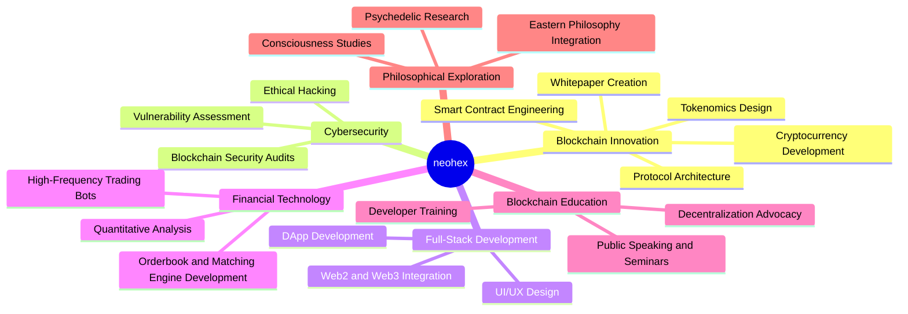

# neohex

- Veteran Blockchain Developer | Security Researcher | Philosophical Explorer

- Bridging the realms of technology, consciousness, and decentralized innovation

[](https://git.io/typing-svg)

## 🧬 Core Skills


### Frameworks:
<!--  - styling -->


<br><br>
### Tools


<!--  -->

<br><br>
<!-- ### Skills: -->


## 🌠Professional Journey

- Timeline
   - 2014 : Began as a web developer
     -          : Delved into ethical hacking
     -          : Introduced to Bitcoin
     - 2016     : Founded own full-stack development company
     -          : Immersed in cryptocurrency development
     -          2016-2024 : Collaborated with 30+ individuals and firms
     -          : Conducted seminars and educational sessions
    -2022 : Shifted focus to perennial philosophy and research
    -2024 : Returned to active development and crypto

## 🌠 Aspirations and Current Focus


## 🛡️ Notable Projects and Achievements

- Developed smart contracts for 7+ cryptocurrencies
- Designed and implemented orderbook and matching engine for a cryptocurrency exchange
- Created Proof of Concept for IQVIA, integrating IPFS, Ethereum, and BigchainDB
- Authored 4 whitepapers for blockchain projects
- Conducted on-chain analysis for 10+ projects
- Provided investment advice to high-net-worth individuals
- Collaborated closely with 3 NFT projects
- Developed tax computation software for crypto transactions

## 🧘 Personal Philosophy and Interests

-  Avid explorer of consciousness, life, and death
-  Practitioner of meditation, yoga, and psychedelic exploration
-  Passionate about Vedas, Upanishads, Buddhist and Zen traditions
-  Inspired by figures such as Ramana Maharshi, Alan Watts, Terence McKenna, Jack Dorsey, Vitalik Buterin, and Satoshi Nakamoto

## 🌱 Current Learning Goals
- Exploring Open Network ecosystem and SVM development
- Deepening knowledge in zero-knowledge proofs and their applications
- Studying quantum computing's potential impact on blockchain technology

## 📝 Writing and Research

- Occasional blogger since 2014, covering technical and spiritual matters
- Ongoing research in quantum analysis and blockchain technologies
- Exploring the intersection of blockchain, consciousness, and decentralized systems

## 🌄 Lifestyle

- Digital nomad, alternating between the Himalayas, Dubai, and Bangalore
- Social introvert, finding balance in spirituality and technology
- Open source prod, Pro crypto, Privacy and Techno geek 

## 🤝 Connect & Collaborate

[](https://github.com/0xneox)
[](https://t.me/binarybodhi)

## 💖 Support My Work


<br>
<br>
[](https://github.com/0xneox/github-readme-stats)


If you find value in my projects or want to support my learning journey:

```
ETH: 0x1AFD4B41FD1fa8060037e01123f27C68CaD2D5e7
```
